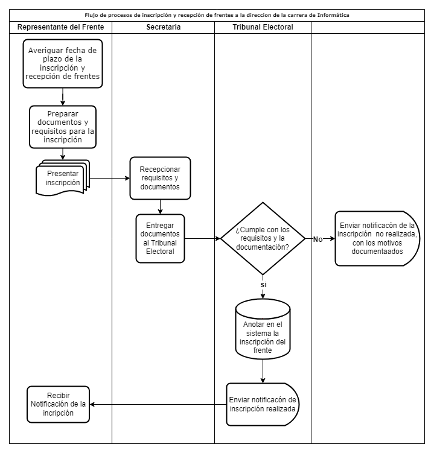
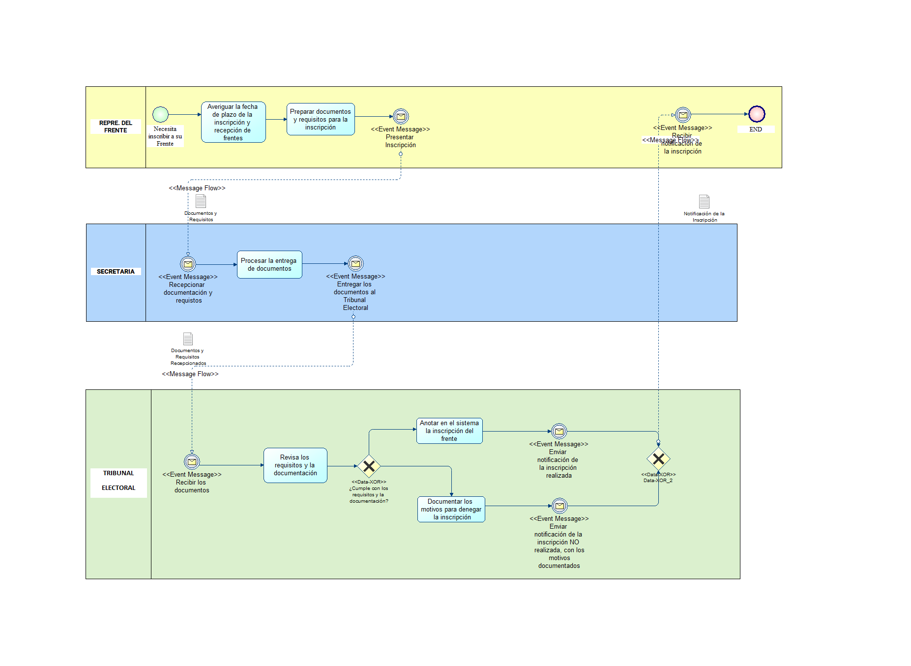

# Examen 2do Parcial INF-324
> Nombre: Neil Angel Graneros Flores.
>
> CI: 9911843 LP
## 1. Realice mediante notación procesos y BPMN para la inscripción y recepción de frentes a la direccion de la carrera (dos notaciones).
### DIAGRAMA DE FLUJO DE PROCESOS

### DIAGRAMA BPMN 

el candidato        tribunal electoral
 diagrama de procesoso

rep frente recepciona llenar requisitos notificara revisan not

motor motor interno 
