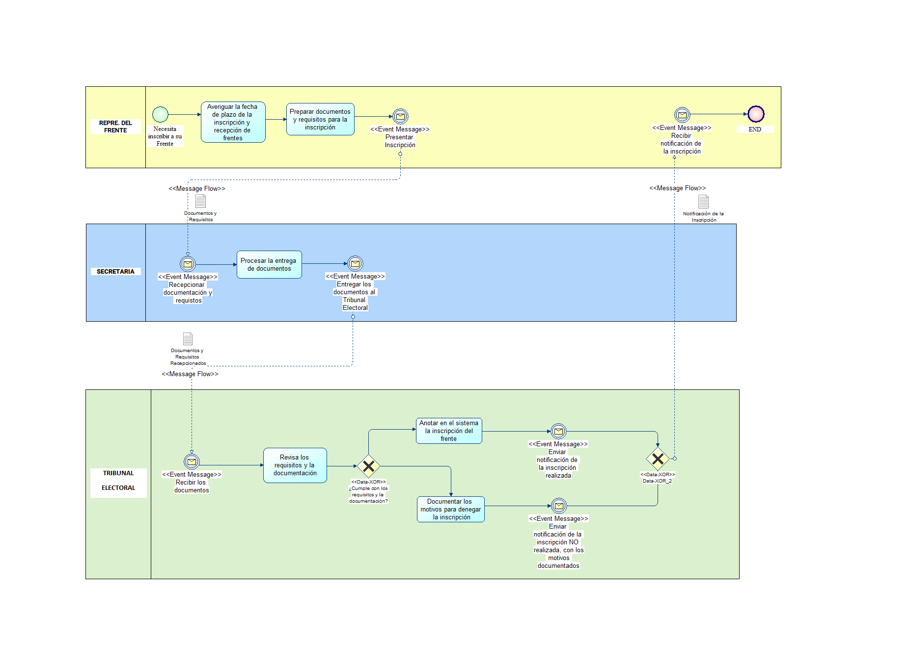

# Examen 2do Parcial INF-324
> Nombre: Neil Angel Graneros Flores.
>
> CI: 9911843 LP
## 1. Realice mediante notación procesos y BPMN para la inscripción y recepción de frentes a la direccion de la carrera (dos notaciones).
### DIAGRAMA DE FLUJO DE PROCESOS

### DIAGRAMA BPMN 

| **FlujoProceso** 	|             	|                      	|          	|                   	|               	|
|:----------------:	|:-----------:	|:--------------------:	|:--------:	|:-----------------:	|:-------------:	|
|     **Flujo**    	| **Proceso** 	| **ProcesoSiguiente** 	| **Tipo** 	|    **Pantalla**   	|    **Rol**    	|
|        F1        	|      P1     	|          P2          	|     I    	|       Inicio      	|   RepFrente   	|
|        F1        	|      P2     	|          P3          	|     P    	|     Documentos    	|   RepFrente   	|
|        F1        	|      P3     	|          P4          	|     P    	|     Presentar     	|   RepFrente   	|
|        F1        	|      P4     	|          P5          	|     P    	|    Recepcionar    	|   Secretaria  	|
|        F1        	|      P5     	|          P6          	|     P    	|      Entregar     	|   Secretaria  	|
|        F1        	|      P6     	|           -          	|     C    	|      Aceptado     	| TribElectoral 	|
|        F1        	|      P7     	|           -          	|     F    	|   CausaNegativa   	| TribElectoral 	|
|        F1        	|      P8     	|          P9          	|     P    	| ControlDocumentos 	| TribElectoral 	|
|        F1        	|      P9     	|          P10         	|     P    	|     EnviarNoti    	| TribElectoral 	|
|        F1        	|     P10     	|                      	|     P    	|    RecibeNotifi   	|   RepFrente   	|

| **FlujoProcesoCondicionante** 	|             	|               	|               	|
|:-----------------------------:	|:-----------:	|:-------------:	|:-------------:	|
|           **Flujo**           	| **Proceso** 	| **ProcesoSI** 	| **ProcesoNO** 	|
|               F1              	|      P5     	|       P7      	|       P6      	|

| **FlujoProcesoSeguimiento** 	|             	|                     	|             	|                 	|                	|              	|             	|
|:---------------------------:	|:-----------:	|:-------------------:	|:-----------:	|:---------------:	|:--------------:	|:------------:	|:-----------:	|
|          **Flujo**          	| **Proceso** 	| **NumeroSolicitud** 	| **Usuario** 	| **FechaInicio** 	| **HoraInicio** 	| **FechaFin** 	| **HoraFin** 	|
|              F1             	|      P1     	|         1000        	|    msilva   	|    20/4/2022    	|      10:00     	|   20/4/2022  	|    14:00    	|
|              F1             	|      P2     	|         1000        	|    msilva   	|    20/4/2022    	|      14:01     	|   22/4/2022  	|    10:00    	|
|              F1             	|      P3     	|         1000        	|    msilva   	|    22/4/2022    	|      10:01     	|              	|             	|
|              F2             	|      P1     	|         2020        	|    msilva   	|    20/4/2022    	|      10:10     	|   21/4/2022  	|    11:10    	|
|              F2             	|      P2     	|         2020        	|    msilva   	|    21/4/2022    	|      11:11     	|              	|             	|
|              F1             	|      P1     	|         1010        	|  jhuaranca  	|    11/4/2022    	|      09:00     	|   11/4/2022  	|    09:10    	|
|              F1             	|      P2     	|          10         	|  jhuaranca  	|    11/4/2022    	|      09:11     	|              	|             	|

| **Rol** 	|                 	|
|:-------:	|:---------------:	|
|  **id** 	| **namerol** 	        |
|    1    	|    RepFrente    	|
|    2    	|    Secretaria   	|
|    3    	|  TribElectoral  	|

| **Usuario** 	|                 	|
|:-----------:	|:---------------:	|
|    **id**   	| **usuario** 	    |
|      1      	|      msilva     	|
|      2      	|    jhuaranca    	|
|      3      	|      malcon     	|

| **RolUsuario** 	|               	|
|:--------------:	|:-------------:	|
|    **IdRol**   	| **IdUsuario** 	|
|        1       	|       1       	|
|        1       	|       2       	|
|        2       	|       3       	|

el candidato        tribunal electoral
 diagrama de procesoso

rep frente recepciona llenar requisitos notificara revisan not

motor motor interno 
